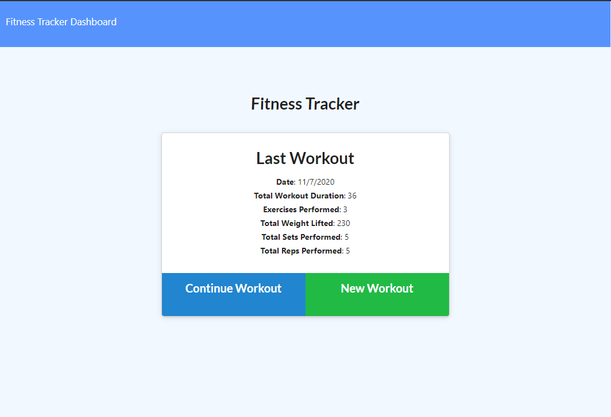
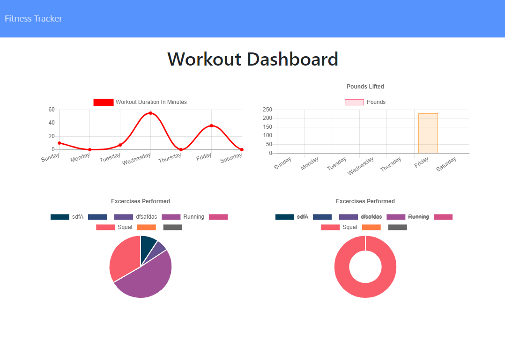

# Workout Tracker
In this application i was able to successfully createa connection between the MongoDB database and the front end code using express routing and mongeese to properly create, get , and display the users workout.

## Image of the APP

## Built With

* [Javascript](https://www.javascript.com/)
* [Node.js](https://nodejs.org/en/)
* [NPM](https://www.npmjs.com/)
* [MongoDB](https://www.mongodb.com/)

## Deployed Site
- [Workout Tracker](https://fathomless-lowlands-69548.herokuapp.com/)
## Github Repository
- [Workout Tracker Repo](https://github.com/GabrielPineda808/workout-tracker)

## Authors

* **Gabriel Pineda** 

- [Link to Github](https://github.com/GabrielPineda808)
- [Link to LinkedIn](https://www.linkedin.com/in/gabriel-pineda-a94535195/)